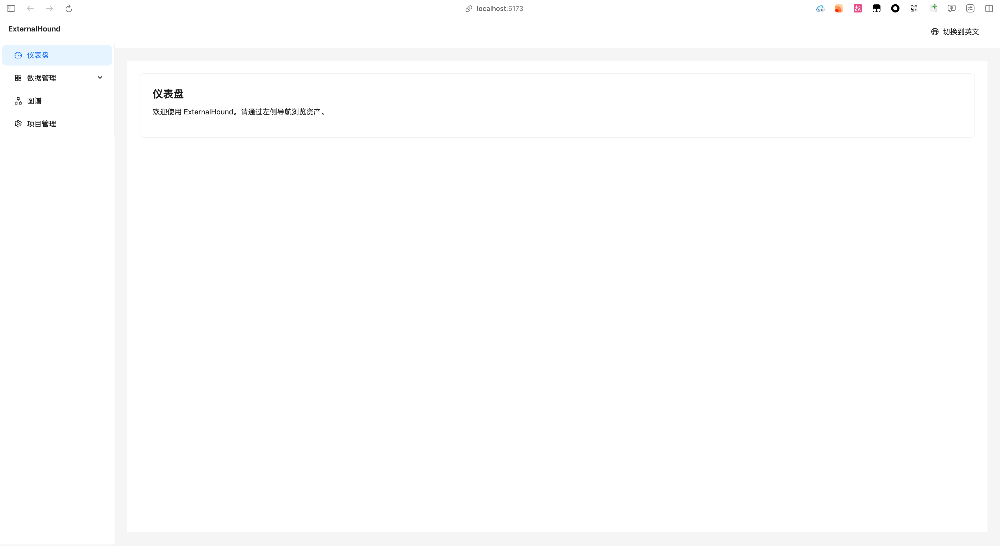
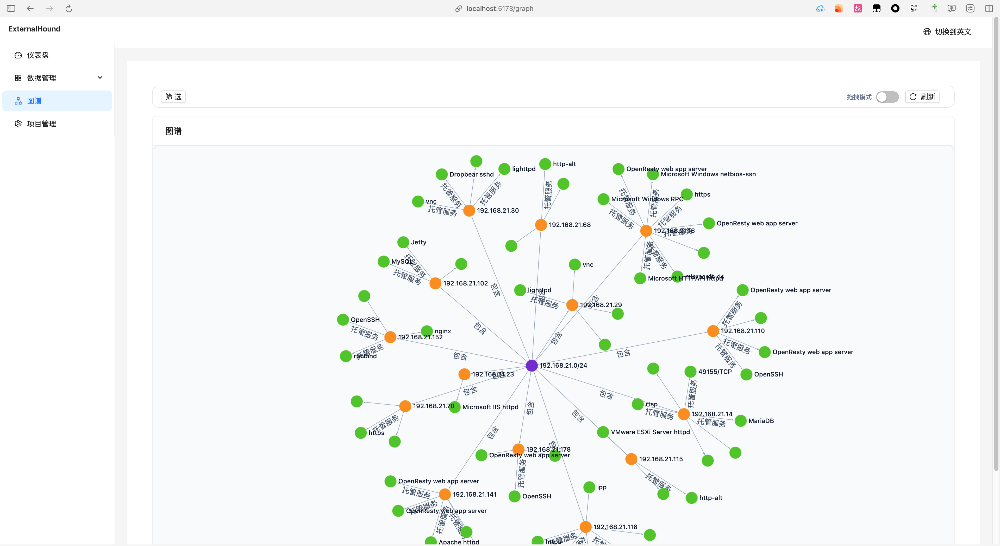
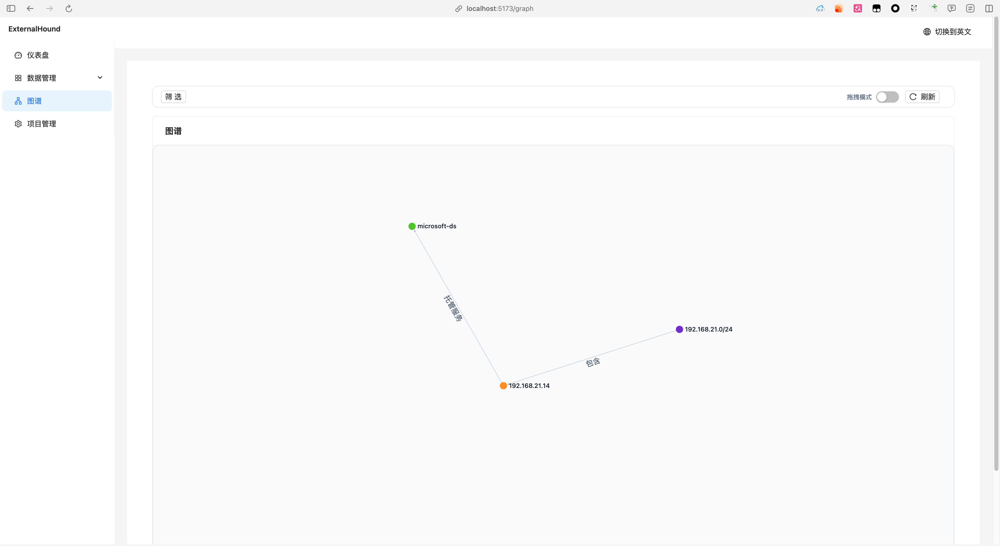

# ExternalHound

<div align="center">

**现代化渗透测试数据管理平台**

一个基于 FastAPI + React 的企业级资产管理和关系图谱可视化平台
专为渗透测试团队、安全研究人员和红队打造

[](https://www.python.org/)
[](https://fastapi.tiangolo.com/)
[](https://reactjs.org/)
[](https://www.typescriptlang.org/)
[](LICENSE)

[功能特性](#核心功能) • [快速开始](#快速开始) • [文档](#文档) • [部署指南](DEPLOYMENT.md) • [贡献指南](#贡献指南)

</div>

---

## ⚠️ 项目状态声明

> **🚧 早期开发版本 (Early Development)**
>
> - 本项目目前处于 **早期开发阶段**（v1.0-alpha），功能和 API 可能随时发生变更
> - **暂未实现完整的安全功能**，不建议在生产环境直接使用
> - 默认配置使用明文密码和弱认证，仅适用于开发和测试环境
> - 计划在 v1.1 版本实现用户认证、权限控制和审计日志
>
> **💡 欢迎反馈**
>
> - 欢迎提交 [Feature Request](https://github.com/bilisheep/ExternalHound/issues/new?labels=enhancement) 功能需求
> - 欢迎提交 [Bug Report](https://github.com/bilisheep/ExternalHound/issues/new?labels=bug) 缺陷报告
> - 欢迎参与 [Discussions](https://github.com/bilisheep/ExternalHound/discussions) 讨论
> - 欢迎 Star ⭐ 和 Fork 本项目

## 项目简介

ExternalHound 是一个专为渗透测试和安全评估设计的资产管理平台，提供强大的数据聚合、关系分析和可视化能力。

## 界面预览

<div align="center">
  
  
  
</div>

### 主要特点

- 🎯 **统一资产管理** - 支持 8 种资产类型，涵盖渗透测试全流程
- 📊 **关系图谱可视化** - 基于 Sigma.js 的高性能图谱渲染引擎
- 🔌 **插件化架构** - 支持自定义数据解析器，轻松集成主流扫描工具
- 🏢 **多项目隔离** - 每个项目独立数据空间，适合团队协作
- 📁 **批量导入** - 支持 Nmap、Masscan 等工具输出的批量导入
- 🔍 **高级搜索** - 标签系统 + 全文搜索 + 复杂过滤器
- ⚡ **高性能** - PostgreSQL + Neo4j 双数据库架构，异步 I/O
- 🔒 **企业级安全** - JWT 认证、RBAC 权限控制（开发中）

## 快速开始

### 前置要求

- Docker 20.10+ 和 Docker Compose 2.0+
- Node.js 18+ (用于前端开发)
- Python 3.11+ (用于后端开发)
- 至少 4GB 可用内存

### 一键启动（推荐）

使用自动化脚本快速启动完整开发环境：

```bash
# 1. 克隆仓库
git clone https://github.com/bilisheep/ExternalHound.git
cd ExternalHound

# 2. 初始化项目（首次运行）
./scripts/bootstrap.sh

# 3. 启动开发环境
./scripts/dev.sh
```

`bootstrap.sh` 会自动：
- 复制配置模板文件
- 启动 Docker 服务（PostgreSQL, Neo4j, MinIO, Redis）
- 等待服务健康检查
- 验证数据库初始化
- 创建 MinIO bucket

`dev.sh` 会自动：
- 检查 Docker 服务状态
- 安装后端和前端依赖
- 运行数据库迁移
- 启动后端服务（http://localhost:8000）
- 启动前端服务（http://localhost:5173）

访问 http://localhost:5173 即可使用系统。

### 配置说明

**配置优先级**: 环境变量 > .env 文件 > config.toml 默认值

详细配置文档请参考 [backend/CONFIG.md](backend/CONFIG.md)

**后端配置**:
- 复制 `backend/config.example.toml` 为 `backend/config.toml`
- 或复制 `backend/.env.example` 为 `backend/.env` (可选)

**前端配置**:
- 复制 `frontend/.env.example` 为 `frontend/.env`
- 配置 `VITE_API_BASE_URL` (默认: http://localhost:8000/api/v1)

**开发环境默认密码**:
- PostgreSQL: `postgres / externalhound_pg_pass`
- Neo4j: `neo4j / externalhound_neo4j_pass`
- MinIO: `admin / externalhound_minio_pass`
- Redis: `externalhound_redis_pass`

⚠️ **生产环境请务必修改所有默认密码！**

## 技术架构

### 后端技术栈
- **框架**: FastAPI 0.109 + Uvicorn
- **数据库**: PostgreSQL 16 (资产数据) + Neo4j 5.x (关系图谱)
- **缓存**: Redis 7.2
- **存储**: 本地文件系统 (开发) / MinIO (生产)
- **ORM**: SQLAlchemy 2.0 (异步)
- **迁移**: Alembic
- **验证**: Pydantic 2.5

### 前端技术栈
- **框架**: React 18.3 + TypeScript
- **构建**: Vite 5.2
- **UI 库**: Ant Design 5.19
- **图可视化**: Sigma.js 2.4 + Graphology
- **状态管理**: Zustand 4.5
- **数据获取**: TanStack React Query 5.45
- **路由**: React Router 6.23
- **HTTP**: Axios 1.7

### 核心功能

#### 资产类型
- **组织 (Organization)** - 目标组织信息
- **域名 (Domain)** - 域名资产及 DNS 信息
- **IP 地址 (IP)** - 主机 IP 及端口信息
- **网段 (Netblock)** - IP 段管理
- **证书 (Certificate)** - SSL/TLS 证书信息
- **服务 (Service)** - 网络服务及版本信息
- **客户端应用 (Client Application)** - 客户端软件及漏洞
- **凭证 (Credential)** - 账号密码等敏感信息

#### 数据导入
- 自动解析 Nmap XML 输出
- 支持自定义解析器插件
- 批量导入与去重
- 导入历史记录与回滚

#### 关系图谱
- 交互式图谱可视化
- 自动发现资产关系
- 多层级关系展开
- 自定义布局算法

#### 项目管理
- 多项目数据隔离
- 独立 Neo4j 图谱实例
- 项目级配置管理

## 项目结构

```
ExternalHound/
├── backend/              # FastAPI 后端
│   ├── app/
│   │   ├── api/v1/      # REST API 路由
│   │   ├── models/      # SQLAlchemy 模型
│   │   ├── schemas/     # Pydantic 模式
│   │   ├── services/    # 业务逻辑层
│   │   ├── repositories/# 数据访问层
│   │   ├── parsers/     # 解析器插件
│   │   └── db/          # 数据库连接
│   ├── alembic/         # 数据库迁移
│   ├── config.toml      # 配置文件（从 config.example.toml 复制）
│   ├── config.example.toml  # 配置模板
│   ├── CONFIG.md        # 配置说明文档
│   └── requirements.txt
├── frontend/            # React 前端
│   ├── src/
│   │   ├── pages/       # 页面组件
│   │   ├── components/  # 可复用组件
│   │   ├── hooks/       # 自定义 Hooks
│   │   ├── services/    # API 客户端
│   │   ├── contexts/    # React Contexts
│   │   └── types/       # TypeScript 类型
│   ├── vite.config.ts
│   └── package.json
├── db/                  # 数据库相关
│   └── init/            # 数据库初始化脚本
│       ├── postgres/    # PostgreSQL 初始化
│       └── neo4j/       # Neo4j 初始化
├── scripts/             # 开发运维脚本
│   ├── bootstrap.sh     # 项目初始化脚本
│   └── dev.sh           # 开发环境启动脚本
├── doc/                 # 详细技术文档 (中文)
├── docker-compose.yml   # 完整环境编排
├── DEPLOYMENT.md        # 部署指南
├── .env.example         # 环境变量模板
└── README.md            # 本文件
```

## 开发指南

### 快速上手

1. **后端开发**: 参考 [doc/DEVELOPMENT.md](doc/DEVELOPMENT.md) 了解如何添加 API、修改数据库、调试等
2. **前端开发**: 参考 [doc/DEVELOPMENT.md](doc/DEVELOPMENT.md) 了解如何添加页面、使用 Hooks、调用 API 等
3. **插件开发**: 参考 [doc/PLUGIN_DEVELOPMENT.md](doc/PLUGIN_DEVELOPMENT.md) 学习如何开发解析器插件

### 常见操作

```bash
# 查看 API 文档
http://localhost:8000/docs

# 数据库迁移
cd backend
alembic revision --autogenerate -m "描述"
alembic upgrade head

# 运行测试
cd backend && pytest
cd frontend && npm test
```

详细的开发指南、调试技巧、性能优化、故障排查等请参考 [doc/DEVELOPMENT.md](doc/DEVELOPMENT.md)

## 部署

详细的生产部署指南请参考 [DEPLOYMENT.md](./DEPLOYMENT.md)，包含：
- 完整的服务配置说明
- 数据库初始化与验证
- 备份与恢复流程
- 性能调优建议
- 安全加固指南
- 故障排查方案

### 快速部署清单

- [ ] 修改所有默认密码
- [ ] 配置生产环境变量
- [ ] 启用 HTTPS/TLS
- [ ] 配置防火墙规则
- [ ] 设置数据备份计划
- [ ] 配置日志收集
- [ ] 启用监控告警

## 文档

详细技术文档位于 `doc/` 目录 (中文):

- [开发指南](doc/DEVELOPMENT.md) - 环境搭建、后端/前端开发、数据库操作、调试技巧等
- [插件开发指南](doc/PLUGIN_DEVELOPMENT.md) - 如何开发自定义解析器插件
- [配置说明](backend/CONFIG.md) - 配置管理、环境变量、优先级等


## 联系方式

- **项目主页**: https://github.com/bilisheep/ExternalHound
- **问题反馈**: https://github.com/bilisheep/ExternalHound/issues
- **功能需求**: https://github.com/bilisheep/ExternalHound/issues/new?labels=enhancement
- **讨论区**: https://github.com/bilisheep/ExternalHound/discussions

---

<div align="center">

**[⬆ 回到顶部](#externalhound)**

Made with ❤️ by the ExternalHound Community

如果这个项目对你有帮助，请给个 Star ⭐

</div>
